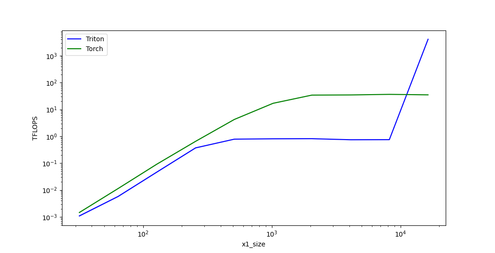

# Triton Kernel For `torch.cdist`

Performant Implementation of `torch.cdist` using [Triton](https://triton-lang.org/), supports backprop.

## Usage

Run `pip install git+https://github.com/jinensetpal/triton_cdist.git`, then witihn your code, include:
```python3
import triton_cdist  # registers operator

# from here you can use it as a stand-in replacement of `torch.cdist`.

x1 = ...
x2 = ...
p = ...
torch.ops.triton_cdist.opt_cdist(x1, x2, p=p)  #  previously, `torch.cdist(x1, x1, p=p)`
```

## Benchmarks

### p = 1:
```
   x1_size  x2_size  rd_size       Triton     Torch
0     32.0     32.0     32.0     0.000987  0.010343
1     64.0     64.0     64.0     0.005554  0.048330
2    128.0    128.0    128.0     0.043991  0.142470
3    256.0    256.0    256.0     0.355691  0.306332
4    512.0    512.0    512.0     0.774858  0.587438
5   1024.0   1024.0   1024.0     0.809252  0.992155
6   2048.0   2048.0   2048.0     0.814649  1.457526
7   4096.0   4096.0   4096.0     0.727230  0.990029
8   8192.0   8192.0   8192.0     0.744964  1.058306
9  16384.0  16384.0  16384.0  3148.153789  1.086596
```


### p = 2:
lp-dist-performance:
   x1_size  x2_size  rd_size       Triton      Torch
0     32.0     32.0     32.0     0.001088   0.001457
1     64.0     64.0     64.0     0.005764   0.011354
2    128.0    128.0    128.0     0.046545   0.091787
3    256.0    256.0    256.0     0.371046   0.649675
4    512.0    512.0    512.0     0.782738   4.238812
5   1024.0   1024.0   1024.0     0.807509  16.929583
6   2048.0   2048.0   2048.0     0.815141  34.141235
7   4096.0   4096.0   4096.0     0.744393  34.659753
8   8192.0   8192.0   8192.0     0.749923  36.397180
9  16384.0  16384.0  16384.0  4105.596799  34.941022
```

```



### p = 10:
```
   x1_size  x2_size  rd_size       Triton     Torch
0     32.0     32.0     32.0     0.000609  0.009752
1     64.0     64.0     64.0     0.004965  0.041374
2    128.0    128.0    128.0     0.039444  0.109500
3    256.0    256.0    256.0     0.311983  0.200992
4    512.0    512.0    512.0     0.779900  0.312088
5   1024.0   1024.0   1024.0     0.807815  0.418651
6   2048.0   2048.0   2048.0     0.815288  0.492365
7   4096.0   4096.0   4096.0     0.746226  0.475460
8   8192.0   8192.0   8192.0     0.743407  0.479933
9  16384.0  16384.0  16384.0  4849.987741  0.487056
```


## Limitations

1. Batching is implemented naively and should be improved. If only one of `x1` or `x2` has a batching dimension, data is broadcasted so you shouldn't observe slowdowns in this case.
