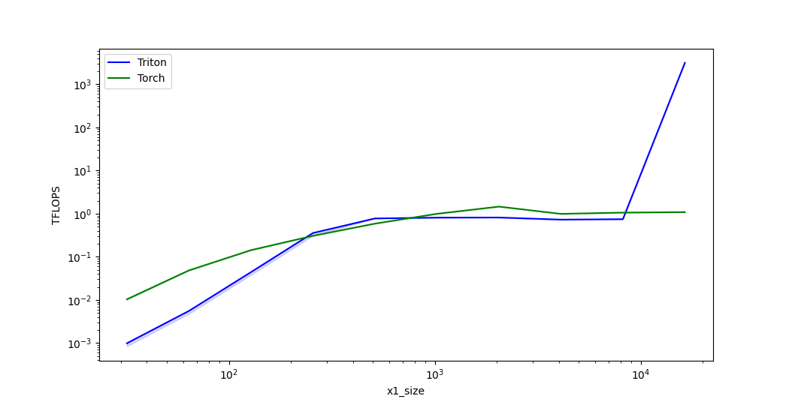
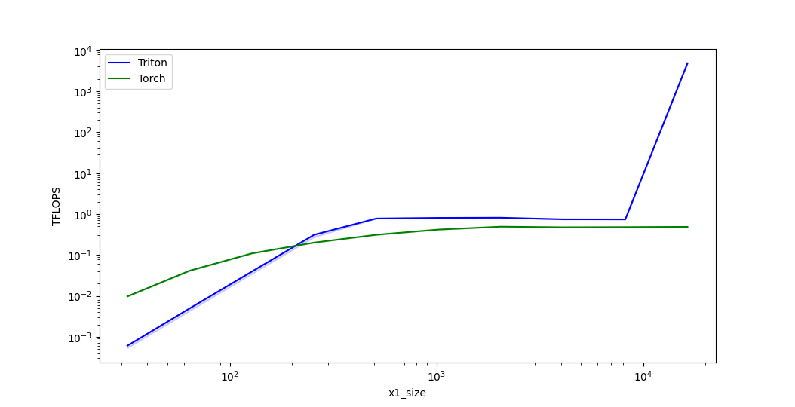

# Triton Kernel For `torch.cdist`

Performant Implementation of `torch.cdist` using [Triton](https://triton-lang.org/), supports backprop.

## Usage

Clone this repository. In the project root, run `pip install -e .`, and witihn your code, include:
```python3
from triton_cdist import lp_reduce  # registers operator

# from here you can use it as a stand-in replacement of `torch.cdist`.

x1 = ...
x2 = ...
p = ...
torch.ops.triton_cdist.opt_cdist(x1, x2, p=p)  #  previously, `torch.cdist(x1, x1, p=p)`
```

## Benchmarks

### p = 1:
```
   x1_size  x2_size  rd_size       Triton     Torch
0     32.0     32.0     32.0     0.001055  0.010039
1     64.0     64.0     64.0     0.005791  0.047628
2    128.0    128.0    128.0     0.046728  0.141699
3    256.0    256.0    256.0     0.370915  0.310505
4    512.0    512.0    512.0     0.782446  0.587973
5   1024.0   1024.0   1024.0     0.809584  0.991254
6   2048.0   2048.0   2048.0     0.814923  1.457696
7   4096.0   4096.0   4096.0     0.778511  1.016069
8   8192.0   8192.0   8192.0     0.764827  1.074763
9  16384.0  16384.0  16384.0  3161.205839  1.098733
```



### p = 2:
```
   x1_size  x2_size  rd_size       Triton      Torch
0     32.0     32.0     32.0     0.000641   0.001448
1     64.0     64.0     64.0     0.005098   0.011338
2    128.0    128.0    128.0     0.040794   0.080610
3    256.0    256.0    256.0     0.323485   0.644484
4    512.0    512.0    512.0     0.782519   4.161016
5   1024.0   1024.0   1024.0     0.809511  17.041356
6   2048.0   2048.0   2048.0     0.813938  34.102198
7   4096.0   4096.0   4096.0     0.758600  34.713258
8   8192.0   8192.0   8192.0     0.760765  35.850885
9  16384.0  16384.0  16384.0  6063.126753  35.545086
```


### p = 10:
```
   x1_size  x2_size  rd_size       Triton     Torch
0     32.0     32.0     32.0     0.000633  0.009570
1     64.0     64.0     64.0     0.005087  0.040554
2    128.0    128.0    128.0     0.040580  0.109227
3    256.0    256.0    256.0     0.324035  0.201610
4    512.0    512.0    512.0     0.782446  0.312658
5   1024.0   1024.0   1024.0     0.810944  0.418672
6   2048.0   2048.0   2048.0     0.815644  0.500449
7   4096.0   4096.0   4096.0     0.751729  0.466386
8   8192.0   8192.0   8192.0     0.758431  0.486487
9  16384.0  16384.0  16384.0  4844.431746  0.496220
```



## Limitations

1. Batching is implemented naively and should be improved. If only one of `x1` or `x2` has a batching dimension, data is broadcasted so you shouldn't observe slowdowns in this case.
